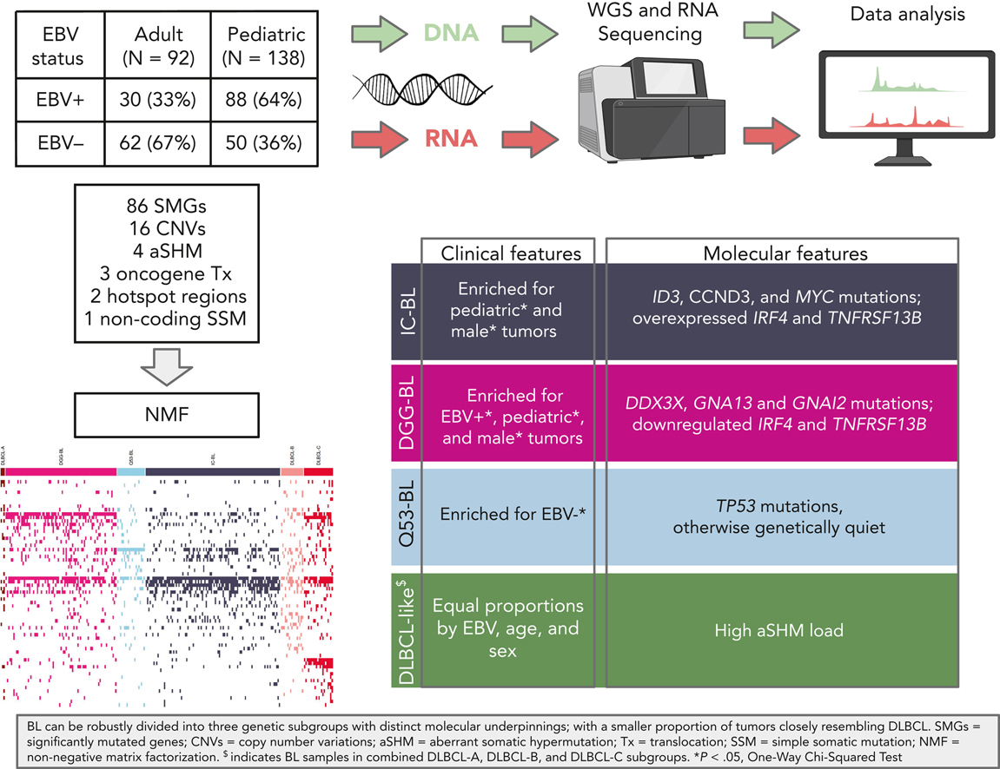
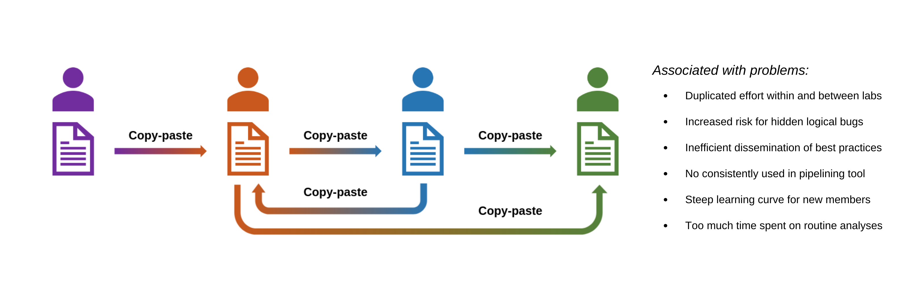
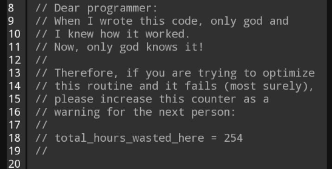
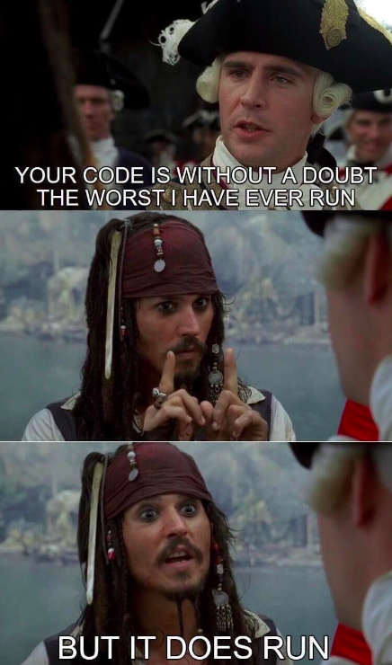
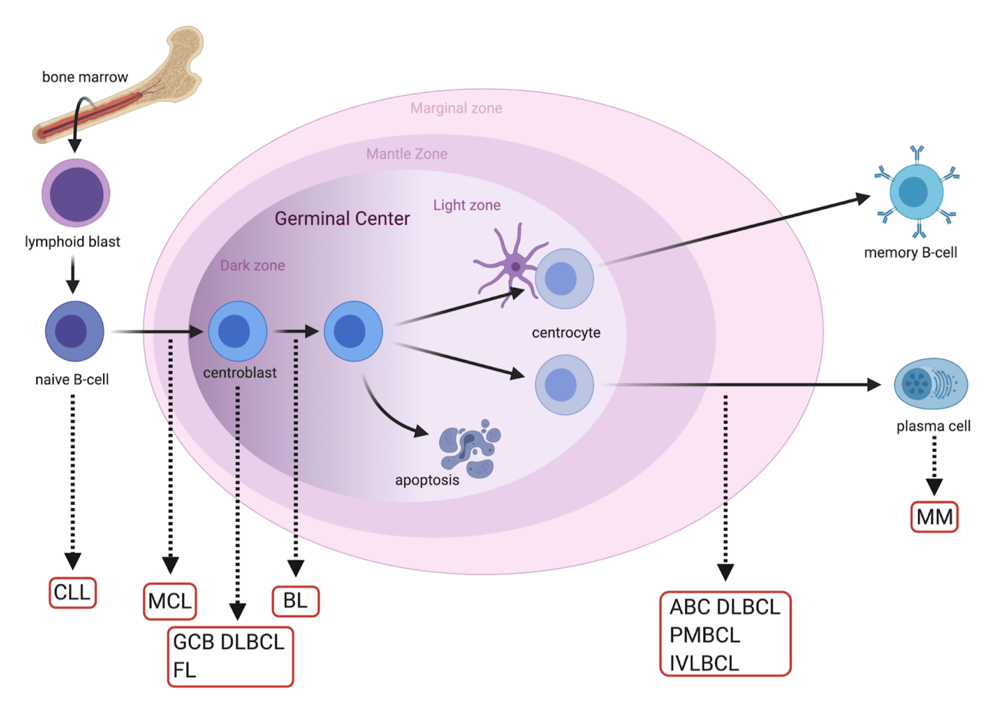
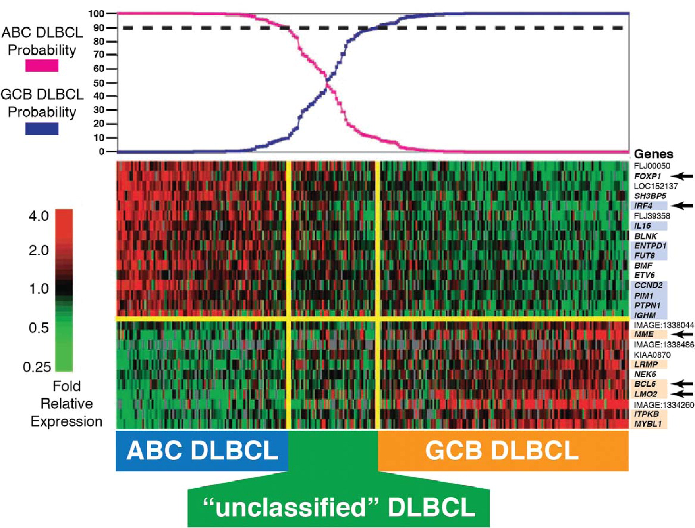
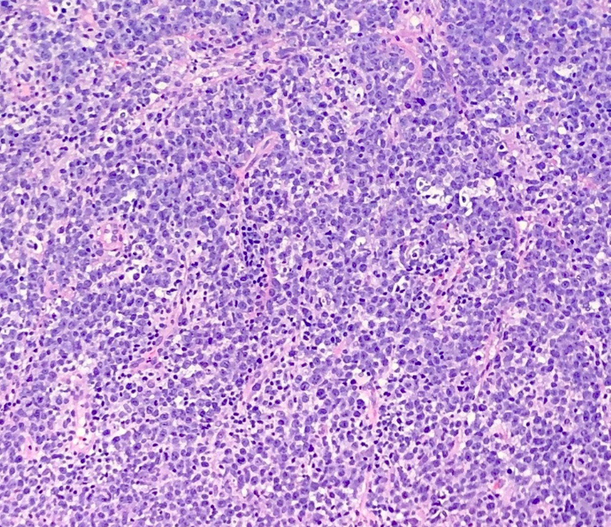
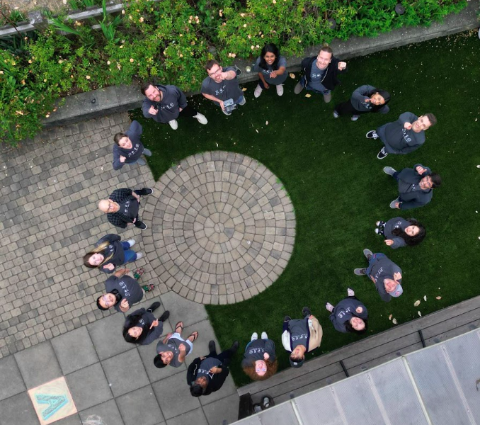
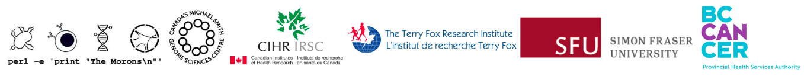

## Example of topics slide

<br/>

- Introduction
- Methods
- Results
- Discussion

# Section title slide

::: {.absolute top="0" left="100%"}
::: {.sectionhead}
1 [2 3 4]{style="opacity:0.25"}
:::
:::

## Add picture

::: {.absolute top="0" left="100%"}
::: {.sectionhead}
1 [2 3 4]{style="opacity:0.25"}
:::
:::



## Add animations

::: {.absolute top="0" left="100%"}
::: {.sectionhead}
1 [2 3 4]{style="opacity:0.25"}
:::
:::


::: {.fragment .semi-fade-out}
{fig-align="center"}
:::

::: {.fragment .fade-in}
{.absolute bottom=0 left=0}
:::

::: {.fragment .fade-in}
{.absolute top=50 right=50 height="600"}
:::

## Highlight animations

::: {.absolute top="0" left="100%"}
::: {.sectionhead}
1 [2 3 4]{style="opacity:0.25"}
:::
:::

:::: columns

::: {.column width="45%"}
::: {.fragment .fade-in}
{.absolute top="20%" left="0" width="600"}
:::
:::

::: {.fragment .fade-in}
::: {data-id="box1" style="background: transparent; width: 70px; height: 70px; border-radius: 4px; box-shadow: 0px 0px 0px 8px rgba(71,148,80); position: relative; top: 175px; left: 115px;"}
:::
::: {data-id="box2" style="background: transparent; width: 100px; height: 90px; border-radius: 4px; box-shadow: 0px 0px 0px 8px rgba(71,148,80); position: relative; top: 275px; left: 385px;"}
:::
:::

::: {.column width="50%"}
::: {.fragment .fade-in}
{.absolute top="20%" right="0" width="450"}
:::
:::
::::


# Another section title

::: {.absolute top="0" left="100%"}
::: {.sectionhead}
[1]{style="opacity:0.25"} 2 [3 4]{style="opacity:0.25"}
:::
:::

## Columns with text{style="text-transform:none;"}

::: {.absolute top="0" left="100%"}
::: {.sectionhead}
[1]{style="opacity:0.25"} 2 [3 4]{style="opacity:0.25"}
:::
:::

:::: {.columns}

::: {.column}
::: {.fragment}
### Positive {style="color:green; text-align: center;"}
:::
- Point 1
- Point 2
- Point 3
:::

::: {.column}
::: {.fragment}
### Negative {style="color:red; text-align: center;"}
:::

- Point 4
- Point 5
- Point 6
- Point 7

:::
::::

Did you notice that the slide title is not capitalized here?

## Columns with image + text

::: {.absolute top="0" left="100%"}
::: {.sectionhead}
[1]{style="opacity:0.25"} 2 [3 4]{style="opacity:0.25"}
:::
:::

:::: columns

::: {.column width="30%"}
{.absolute top="30%" left="0" width="250" height="250"}
:::

::: {.column width="65%"}

- This is DLBCL
- Most common NHL

:::{.fragment}
##### Key Facts
- Fast-growing
- Has many subtypes
- ...
:::
:::
::::

## Columns + diagram  {style="font-size: 70%;"}

::: {.absolute top="0" left="100%"}
::: {.sectionhead}
[1]{style="opacity:0.25"} 2 [3 4]{style="opacity:0.25"}
:::
:::

:::: columns

::: {.column width="65%"}
* Notice how the font is different here for the title slide and the items in the list
* [GAMBLR.data](https://github.com/morinlab/GAMBLR.data) - collection of genomic data for analysis of Mature B-cell neoplasms
* [GAMBLR.helpers](https://github.com/morinlab/GAMBLR.helpers) - a set of low-level functions for data operation

:::

::: {.column width="30%"}

```{mermaid}
flowchart TD
  A("GAMBLR.data") --> B("GAMBLR.helpers")
  B --> C("GAMBLR.utils")
  C --> D("GAMBLR.viz")
  D --> E{"GAMBL member?"}
  E -- YES --> F("GAMBLR.results")
  E -- NO --> A
```

:::
::::

# New section

::: {.absolute top="0" left="100%"}
::: {.sectionhead}
[1 2]{style="opacity:0.25"} 3 [4]{style="opacity:0.25"}
:::
:::

## Show some code

::: {.absolute top="0" left="100%"}
::: {.sectionhead}
[1 2]{style="opacity:0.25"} 3 [4]{style="opacity:0.25"}
:::
:::

We can show the code `in text` or as a separate code block.

```r
if (!require("devtools")) install.packages("devtools")

devtools::install_github(
    "morinlab/GAMBLR.data",
    repos = BiocManager::repositories()
)
```


## Render plot from R

::: {.absolute top="0" left="100%"}
::: {.sectionhead}
[1 2]{style="opacity:0.25"} 3 [4]{style="opacity:0.25"}
:::
:::

The impact of temperature on ozone level

```{r}
library(ggplot2)

ggplot(airquality, aes(Temp, Ozone)) + 
  geom_point() + 
  geom_smooth(method = "loess")
```

# Final section

::: {.absolute top="0" left="100%"}
::: {.sectionhead}
[1 2 3]{style="opacity:0.25"} 4
:::
:::

## Acknowledgments

::: {layout="[[1,1], [0.2]]"}


:::: columns

::: {.column style="font-size: 65%;"}

##### Morin Lab

Ryan D. Morin<br/>
Jasper Wong<br/>
Aixiang Jiang<br/>
Sierra Gillis<br/>
Houman L. Mirhosseini<br/>
Giuliano Banco<br/>
Callum Brown<br/>
Luke Klossok

:::

::: {.column style="font-size: 65%;"}

##### CLC

David W. Scott<br/>
Christian Steidl<br/>
Laura K. Hilton<br/>
Barbara Meissner<br/>
Brett Collinge<br/>

##### Lab Alumni

Malki Wijesinghe<br/>
Kurt Yakimovich<br/>
Manuela Cruz<br/>
Krysta Coyle<br/>
Quratulain Qureshi<br/>

:::
::::


:::
